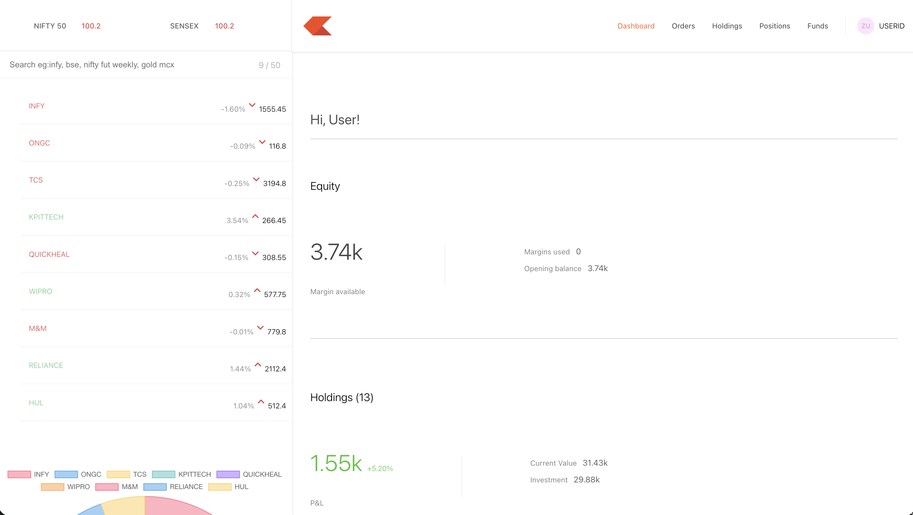

# 📈 Stock Monitoring Platform

A full-stack stock monitoring platform, built using the MERN stack. The application provides a modern landing website along with an interactive trading dashboard where users can monitor holdings, positions, and orders.

## 🚀 Live Demo

### 🌐 Landing Website
https://your-frontend-url.onrender.com

### 📊 Trading Dashboard
https://your-dashboard-url.onrender.com

## ✨ Features

### Landing Website
- Responsive UI
- Home, About, Products, Pricing, Support pages
- Interactive design
- Modern Bootstrap layout

### Trading Dashboard
- Dashboard overview
- Holdings management
- Positions tracking
- Orders page
- Buy stock window
- Static API integration

### Backend
- REST APIs
- MongoDB Atlas integration
- Express.js server
- CORS enabled
- CRUD operations

---

## 🛠 Tech Stack

### Frontend
- React.js
- React Router
- Bootstrap
- Axios

### Backend
- Node.js
- Express.js
- MongoDB Atlas
- Mongoose

### Deployment
- Render
- GitHub

---

## 📂 Project Structure

```
Stock-Monitoring/
│
├── frontend/      # Landing Website
├── dashboard/     # Trading Dashboard
├── backend/       # Express API
└── README.md
```

---

## 📸 Screenshots

### Landing Page



### Dashboard


### Holdings


### Orders


---

## ⚙️ Installation

### Clone the repository

```bash
git clone https://github.com/rudraydv09/Stock-Monitoring.git
```

### Install dependencies

Backend

```bash
cd backend
npm install
npm start
```

Frontend

```bash
cd frontend
npm install
npm start
```

Dashboard

```bash
cd dashboard
npm install
npm start
```

---

## API Endpoints

### Holdings

```
GET /allHoldings
```

### Positions

```
GET /allPositions
```

### Orders

```
GET /allOrders
```

### Place Order

```
POST /newOrder
```

---

## Future Improvements

- User Authentication
- Real-time Stock Prices
- Portfolio Analytics
- Charts & Graphs
- Watchlist
- Search Stocks
- Dark Mode

---

## Author

**Rudra Pratap Singh Yadav**

LinkedIn:
https://linkedin.com/in/rudra0912

GitHub:
https://github.com/rudraydv09
